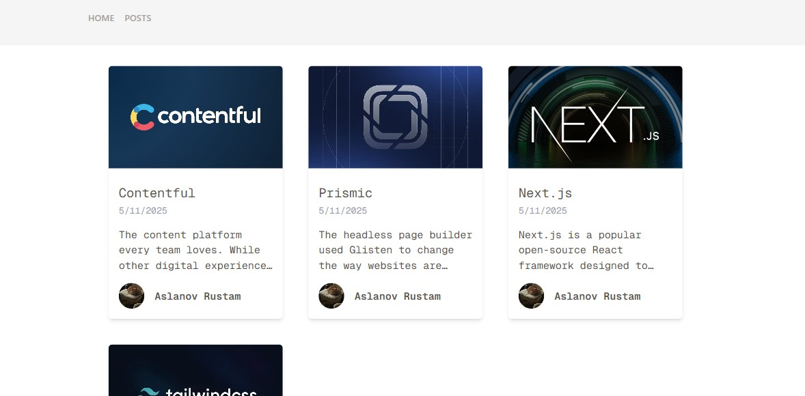

# Next.js Blog with Contentful CMS

This project is a blog built with [Next.js](https://nextjs.org/) and powered by [Contentful](https://www.contentful.com/), a headless CMS for managing content easily and flexibly.



## Features

- ✅ Static Site Generation (SSG) with Next.js
- 📄 Markdown / Rich text content from Contentful
- 📦 Responsive image rendering with Next.js Image optimization
- 💨 Styled with Tailwind CSS
- 📰 Dynamic routes for blog posts
- 🧑 Author support, dates, and cover images

## Technologies

- [Next.js](https://nextjs.org/)
- [Contentful](https://www.contentful.com/)
- [Tailwind CSS](https://tailwindcss.com/)
- [React](https://reactjs.org/)

## Getting Started

### 1. Clone the repo

```bash
git clone https://github.com/AslanovRustam/contentful.git
cd contentful
```

### 2. Install dependencies

```bash
npm install
# or
yarn
```

### 3. Create .env.local and add your environment variables

```bash
CONTENTFUL_SPACE_ID=your_space_id
CONTENTFUL_ACCESS_TOKEN=your_access_token
CONTENTFUL_PREVIEW_TOKEN=your_preview_token
CONTENTFUL_PREVIEW_SECRET=your_preview_secret
```

You can get these keys from your Contentful account under API settings.

### 4. Run the development server

```bash
npm run dev
# or
yarn dev
```

Open http://localhost:3000 to see your blog.

#### Content Modeling in Contentful

Your Contentful space should include:

A Post content type with fields like:

title (Short text)

slug (Short text)

coverImage (Media)

excerpt (Text)

content (Rich Text or Markdown)

author (Reference to Author)

createdDate (Date)

video (optional, for embeds like YouTube)

An Author content type with:

name

picture (Media)
